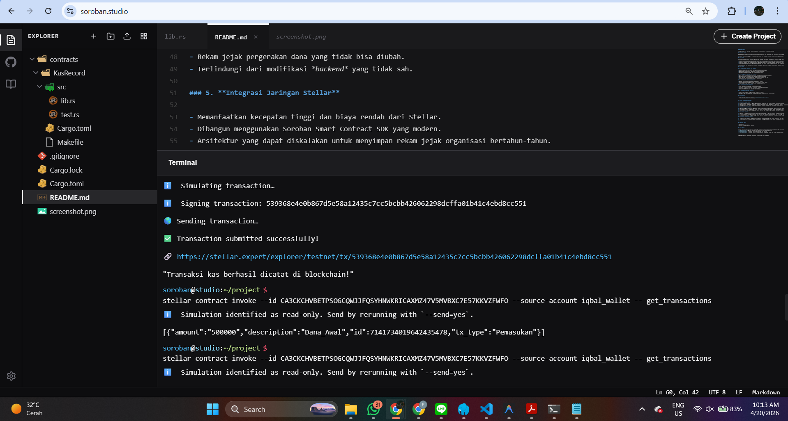
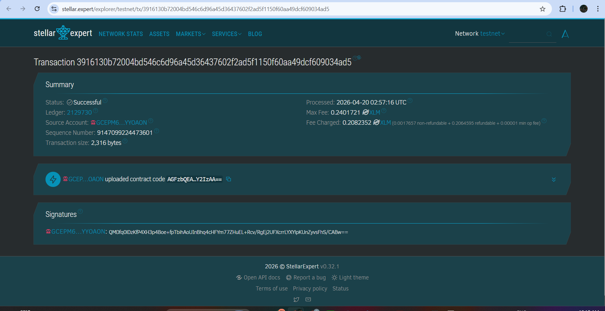

# OrgLedger DApp

**OrgLedger App** - Blockchain-Based Transparent Treasury Ledger for Student Organizations

## Project Description

OrgLedger DApp is a decentralized smart contract solution built on the Stellar blockchain using the Soroban SDK. It provides a secure, immutable platform for managing organizational treasury (kas) directly on the blockchain. The contract ensures that financial data is stored transparently and is only manageable through predefined smart contract functions, eliminating reliance on centralized spreadsheets or easily manipulated local databases.

The system allows organizational boards (such as student executive boards or associations) to record income and expenses, view the entire financial history, and void erroneous inputs, leveraging the efficiency and security of the Stellar network. Each transaction is uniquely identified and stored within the contract's instance storage, ensuring absolute financial accountability.

## Project Vision

Our vision is to revolutionize organizational finance and build absolute trust within communities by:

- **Decentralizing Financial Data**: Moving organizational ledgers from vulnerable local files to a global, distributed blockchain.
- **Ensuring Transparency**: Empowering every member to have full visibility over cash inflows and outflows.
- **Guaranteeing Immutability**: Providing a permanent, tamper-proof record of transactions that cannot be secretly altered or deleted by rogue administrators.
- **Enhancing Accountability**: Fostering an environment of trust where data integrity is guaranteed by code, preventing financial mismanagement.

We envision a future where digital treasury management is completely transparent, empowering organizational members with complete autonomy and oversight over their collective funds.

## Key Features

### 1. **Simple Transaction Recording**

- Record income or expenses with just one function call.
- Specify transaction type, amount, and description for context.
- Automated ID generation for unique transaction identification.
- Persistent and secure storage on the Stellar blockchain.

### 2. **Efficient Ledger Retrieval**

- Fetch the entire organizational transaction history in a single call.
- Structured data representation for easy frontend integration.
- Quick, transparent access for all members to audit the treasury.
- Real-time synchronization with the blockchain state.

### 3. **Secure Voiding**

- Invalidate specific incorrect entries using their unique IDs.
- Clean and efficient storage management for typo corrections.
- Immediate update of the ledger list after a void action.

### 4. **Transparency and Security**

- View all financial activities on the public blockchain.
- Blockchain-based verification of all storage actions.
- Immutable records of fund movements.
- Protected against unauthorized backend modifications.

### 5. **Stellar Network Integration**

- Leverages the high speed and low cost of Stellar.
- Built using the modern Soroban Smart Contract SDK.
- Scalable architecture for years of organizational records.

## Contract Details

- Contract Address: `CA3CKCHVBETPSOGCQWJJFQSYHNWKRICAXMZ47V5MVBXC7E57KKVZFWFO`
  
  

## Future Scope

### Short-Term Enhancements

1. **Receipt IPFS Attachment**: Capability to attach digital assets (like scanned physical receipts) to specific transactions using decentralized storage.
2. **Categorization**: Add tags to organize expenses (e.g., "Event Funding", "Daily Operations").
3. **Multi-Currency Support**: Expand to support multiple tokenized assets beyond the native token.

### Medium-Term Development

4. **Multi-Signature Approvals**: Implement multi-signature requirements for recording large withdrawals to prevent unilateral spending.
5. **Notification System**: Off-chain bridge to alert all members of new large expenses.
6. **Inter-Contract Integration**: Allow other smart contracts (like event ticketing dApps) to interact with and automatically route funds to this treasury contract.

### Long-Term Vision

7. **Decentralized UI Hosting**: Host the frontend on IPFS or similar decentralized platforms.
8. **DAO Governance**: Community-driven protocol improvements where fund allocations are voted on by members before being executed.
9. **Identity Management**: Integration with decentralized identity (DID) systems to verify which board member initiated a transaction.

### Enterprise Features

10. **Campus-Wide Adaptation**: Adapt the system for secure, university-wide student executive board (BEM) record-keeping.
11. **Automated Auditing**: Automatic report generation for periodic accountability reporting to campus administration.

---

## Technical Requirements

- Soroban SDK
- Rust programming language
- Stellar blockchain network (Testnet)

## Getting Started

Deploy the smart contract to Stellar's Soroban network and interact with it using the three main functions:

- `add_transaction()` - Record a new income or expense with its details.
- `get_transactions()` - Retrieve the entire financial ledger from the contract.
- `void_transaction()` - Remove a specific transaction record by its ID in case of input errors.

---

**OrgLedger DApp** - Securing Organizational Trust on the Blockchain